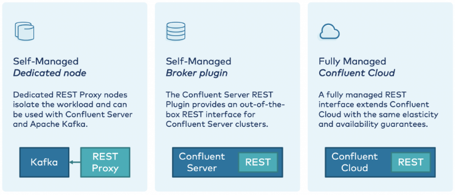
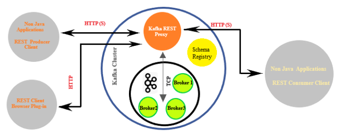
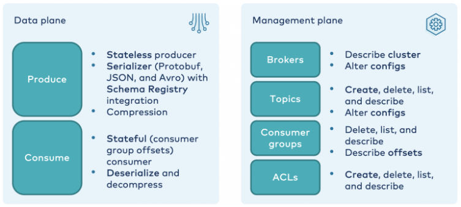
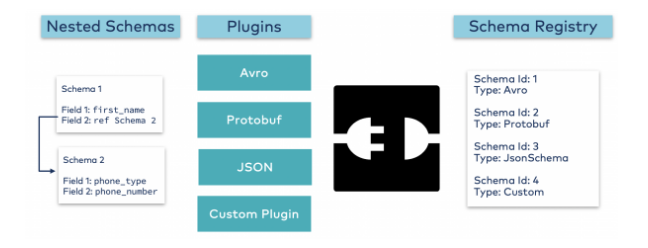

# **Kafka Rest**

## **Objetivo**

O objetivo deste playbook é documentar a forma e as possibilidades de uso da aplicação kafka-rest, parte integrande da suite Confluent.

## **Stack Tecnológico**

- Kafka
- Zookeeper
- kafka-rest

## Premissas 

- **Kafka broker** e **Zookeeper** configurados corretamente para integração com o **Kafka Rest**

## Conceitos 

O Kafka Rest é um proxy parte do ecossistema da Confluent, que pode ser executado independentemente e fornece endpoints para integrações através de interfaces RESTful.
Com o proxy conseguimos produzir e consumir mensagens além de verificar as configurações do cluster e administrar o suas configurações.



## Modelo de arquitetura



## Modelo de operações disponibilizadas




# Modelo de Funcionamento

## Applicação isolada para integrações com Apache Kafka

Para realizar a integração com o Apache Kafka é necessário fornecer um arquivo de configurações properties com os campos necessários para a correta comunicação no formato:
```
java -jar kafka-rest-6.2.0-standalone.jar /opt/sysmanager/kafkarest.properties 
```

## Applicação integrada com Schema Registry

Na utilização com Schema Registry, é necessário também informar os dados para integração com o Schema Registry e o funcionamento é detalhado no diagrama abaixo:




## Configurações

Para configurar corretamente a integração com os outros sistemas é necessário descrever no arquivo properties pelo menos os endereços corretos do Apache Kafka e Zookeeper.

```properties
id=kafka-rest-test-server
schema.registry.url=http://localhost:8081
zookeeper.connect=localhost:2181
bootstrap.servers=PLAINTEXT://localhost:9092
```

Existem várias configurações disponíveis ao Kafka Rest que são detalhadas no link abaixo:
https://docs.confluent.io/platform/current/kafka-rest/production-deployment/rest-proxy/config.html

# Funcionalidades

## Metadata
Retorna informações sobre o cluster através de chamadas GET e fornece dados como brokers, topicos, partições e configurações.


## Producers
Endpoint dedicao a enviar mensagens específicas para tópicos ou partições.


## Configurações de Producers
Endpoint para realizar a configuração global dos producers.

## Consumers
Endpoint dedicado para consumir mensagens cadastradas em um determinado tópico automaticamente ou através de seu offset. Os consumers são atrelados à instância do proxy utilizado.

## Configurações de Consumers 
Endpoint para realizar a configuração global dos consumers.

## Formato de mensages
- JSON
- raw bytes
- JSON Avro
- Protobuf
- JSON Schema

## Modo distribuido
A aplicação Rest Proxy é capaz de funcionar em multiplas instâncias e pode ser acessada através de um load balance para distribuir a carga entre as instâncias.

## Administração de tópicos
Através da API V3 é possivel deletar, criar e alterar tópicos e suas configurações.


# Limitações

Atualmente só é possivel enviar mensagens para somente um tópico e partição.
Apesar de suportar modo distribuído, toda a comunicação é sincrona e os consumidores são atrelados a um tópico.

# Exemplos de utilização
A Api conforme descrita acima possui muitos endpoints, é possivel configurar suas configurações de segurança e estão disponíveis na V2 e na V3
https://docs.confluent.io/platform/current/kafka-rest/api.html

## Listagem das informações do cluster

`
http://localhost:8082/v3/clusters
`


```JSON
{
  "kind": "KafkaClusterList",
  "metadata": {
    "self": "http://localhost:8082/v3/clusters",
    "next": null
  },
  "data": [
    {
      "kind": "KafkaCluster",
      "metadata": {
        "self": "http://localhost:8082/v3/clusters/eZ6H1ZP2QrShPSyQfjn-VQ",
        "resource_name": "crn:///kafka=eZ6H1ZP2QrShPSyQfjn-VQ"
      },
      "cluster_id": "eZ6H1ZP2QrShPSyQfjn-VQ",
      "controller": {
        "related": "http://localhost:8082/v3/clusters/eZ6H1ZP2QrShPSyQfjn-VQ/brokers/0"
      },
      "acls": {
        "related": "http://localhost:8082/v3/clusters/eZ6H1ZP2QrShPSyQfjn-VQ/acls"
      },
      "brokers": {
        "related": "http://localhost:8082/v3/clusters/eZ6H1ZP2QrShPSyQfjn-VQ/brokers"
      },
      "broker_configs": {
        "related": "http://localhost:8082/v3/clusters/eZ6H1ZP2QrShPSyQfjn-VQ/broker-configs"
      },
      "consumer_groups": {
        "related": "http://localhost:8082/v3/clusters/eZ6H1ZP2QrShPSyQfjn-VQ/consumer-groups"
      },
      "topics": {
        "related": "http://localhost:8082/v3/clusters/eZ6H1ZP2QrShPSyQfjn-VQ/topics"
      },
      "partition_reassignments": {
        "related": "http://localhost:8082/v3/clusters/eZ6H1ZP2QrShPSyQfjn-VQ/topics/-/partitions/-/reassignment"
      }
    }
  ]
}
```

## Listagem de informações de um dos broker

`
http://localhost:8082/v3/clusters/<broker-id>/brokers/0
`

```JSON
{
  "kind": "KafkaBroker",
  "metadata": {
    "self": "http://localhost:8082/v3/clusters/eZ6H1ZP2QrShPSyQfjn-VQ/brokers/0",
    "resource_name": "crn:///kafka=eZ6H1ZP2QrShPSyQfjn-VQ/broker=0"
  },
  "cluster_id": "eZ6H1ZP2QrShPSyQfjn-VQ",
  "broker_id": 0,
  "host": "andre-ubuntu",
  "port": 9092,
  "rack": null,
  "configs": {
    "related": "http://localhost:8082/v3/clusters/eZ6H1ZP2QrShPSyQfjn-VQ/brokers/0/configs"
  },
  "partition_replicas": {
    "related": "http://localhost:8082/v3/clusters/eZ6H1ZP2QrShPSyQfjn-VQ/brokers/0/partition-replicas"
  }
}
```

## Listagem de informações de um dos broker

`
http://localhost:8082/v3/clusters/<broker-id>/brokers/0
`

```JSON
{
  "kind": "KafkaBroker",
  "metadata": {
    "self": "http://localhost:8082/v3/clusters/eZ6H1ZP2QrShPSyQfjn-VQ/brokers/0",
    "resource_name": "crn:///kafka=eZ6H1ZP2QrShPSyQfjn-VQ/broker=0"
  },
  "cluster_id": "eZ6H1ZP2QrShPSyQfjn-VQ",
  "broker_id": 0,
  "host": "andre-ubuntu",
  "port": 9092,
  "rack": null,
  "configs": {
    "related": "http://localhost:8082/v3/clusters/eZ6H1ZP2QrShPSyQfjn-VQ/brokers/0/configs"
  },
  "partition_replicas": {
    "related": "http://localhost:8082/v3/clusters/eZ6H1ZP2QrShPSyQfjn-VQ/brokers/0/partition-replicas"
  }
}
```


## Informações das réplicas do broker

`
http://localhost:8082/v3/clusters/<broker-id>/0/partition-replicas
`

```JSON
{
    "kind": "KafkaReplicaList",
    "metadata": {
        "self": "http://localhost:8082/v3/clusters/eZ6H1ZP2QrShPSyQfjn-VQ/brokers/0/partition-replicas",
        "next": null
    },
    "data": []
}
```

## Criação de tópicos
```bash
curl -X POST -H "Content-Type: application/json" \
--data '{"topic_name": "teste"}' http://localhost:8082/v3/clusters/sRCFjfUiTB6aNcn7Ud-bUQ/topics | jq
```

## Descrição do tópico
```bash
curl --silent -X GET http://localhost:8082/v3/clusters/sRCFjfUiTB6aNcn7Ud-bUQ/topics/teste | jq
```

## Criação de consumer
```bash
curl --location --request POST 'http://localhost:8082/consumers/testgroup' \
--header 'Content-Type: application/vnd.kafka.v2+json' \
--data-raw '{
  "name": "my_consumer",
  "format": "binary",
  "auto.offset.reset": "earliest",
  "auto.commit.enable": "false"
}'
```

## Subscripção em um tópico
```bash
curl --location --request POST 'http://localhost:8082/consumers/testgroup/instances/my_consumer/subscription' \
--header 'Content-Type: application/vnd.kafka.v2+json' \
--data-raw '{
  "topics": [
    "test"
  ]
}'
```

## Recuperar o conteúdo do tópico
```bash
curl --location --request GET 'http://localhost:8082/consumers/testgroup/instances/my_consumer/records' | jq
```

# Utilização com microserviço utilizando Quarkus e kafka

## Alternativamente podemos utilizar a integração do Quarkus com Kafka nos microserviços isoladamente


# Modo de utilização

## Configuração
É necessário configurar corretamente a integração com os serviços através de seu arquivo properties:
```properties
mp.messaging.incoming.in.connector=smallrye-kafka
mp.messaging.incoming.in.topic=transactions
mp.messaging.incoming.in.value.deserializer=org.acme.model.TransactionDeserializer
mp.messaging.incoming.in.auto.offset.reset=earliest
mp.messaging.incoming.in.enable.auto.commit=false

mp.messaging.outgoing.out.connector=smallrye-kafka
mp.messaging.outgoing.out.topic=output
mp.messaging.outgoing.out.value.serializer=io.quarkus.kafka.client.serialization.JsonbSerializer
```

## Controle de transação
O controle das mensagens pode ser sincrono ou assincrono conforme o snippet abaixo:

```java
@RegisterRestClient(configKey = "transaction-service")
@Produces(MediaType.APPLICATION_JSON)
@Consumes(MediaType.APPLICATION_JSON)
public interface TransactionService {

    @Path("/transactions")
    @POST
    TransactionResult postSync(Transaction transaction);

    @Path("/transactions")
    @POST
    Uni<TransactionResult> postAsync(Transaction transaction);

}
```

## Uso para mensagens Síncronas
As anotações de Incoming definem a fila de entrada e Outgoing a fila de saída e Blocking é importante para garantir o sincronismo.

```java
@ApplicationScoped
public class TransactionProcessor {

    private static final Logger LOGGER = Logger.getLogger("TransactionProcessor");

    @Inject @RestClient TransactionService service;

    @Incoming("in")
    @Outgoing("out")
    @Blocking
    public TransactionResult sendToTransactionService(Transaction transaction) {
        LOGGER.infof("Sending %s transaction service", transaction);
        return service.postSync(transaction);
    }

}
```

## Uso para mensagens Síncronas
As anotações de Incoming definem a fila de entrada e Outgoing a fila de saída.
```java
@ApplicationScoped
public class TransactionProcessor {

    private static final Logger LOGGER = Logger.getLogger("TransactionProcessor");

    @Inject @RestClient TransactionService service;

    @Incoming("in")
    @Outgoing("out")
    public Uni<TransactionResult> sendToTransactionService(Transaction transaction) {
        LOGGER.infof("Sending %s transaction service", transaction);
        return service.postAsync(transaction);
    }

}
```


## Referências

- https://docs.confluent.io/platform/current/kafka-rest/index.html
- https://docs.confluent.io/platform/current/kafka-rest/production-deployment/rest-proxy/config.html
- https://dzone.com/articles/confluent-kafka-rest-proxy-data-movement-operational-cluster
- https://quarkus.io/blog/kafka-rest-client/
- https://www.instaclustr.com/support/documentation/kafka-add-ons/kafka-rest-proxy/
- https://www.confluent.io/blog/http-and-rest-api-use-cases-and-architecture-with-apache-kafka/
- https://www.confluent.io/blog/confluent-rest-proxy-putting-kafka-to-rest/
- https://www.confluent.io/blog/confluent-rest-proxy-putting-kafka-to-rest/


